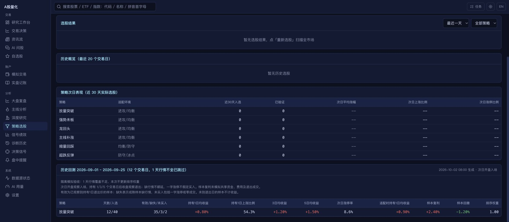

# 数据源稳定性与策略正确性

继续参考 [daily_stock_analysis 固定提交 be148f39](https://github.com/ZhuLinsen/daily_stock_analysis/tree/be148f39ce3be8bc7f9c2d5b0ad77cd31655e78f) 的多源取数、规则筛选、数据质量与回测闭环，落实用户“最重要的数据源稳定，以及策略”的优先级，范围仍为现有 A 股。来源配置、供应商单位及上一阶段界面说明见 [UI 与数据源对齐](ui_data_source_alignment.md)。

## 取数故障处理

- 所有来源熔断时返回明确失败，遵守 300 秒冷却，不再强制请求第一个来源。冷却后只有真正轮到请求的来源才领取探测机会，前一个来源成功不会占用后备来源的探测。
- 单源重试恢复后清除该源的本次错误；异常日志与公开健康记录使用脱敏后的文字。重复来源按第一次出现的顺序请求。
- 全部实时行情来源失败、或者行情写库失败会抛出错误，编排器据此记录失败并执行原有重试流程，不再显示“采集成功”。并发行情、上一交易日补齐和大盘概况读取完成后关闭客户端。
- 实时全市场空结果属于失败；个股历史或财务接口的空结果可能是新股、停牌或没有该期数据，只记录无数据，不凭空把整个供应商熔断。请求异常和无效格式仍计入熔断。
- 更新当天行情时同步股票简称，ST/退市标记变化能进入股票池过滤；来源没给名字时保留已有名称。

这些行为不保证外部接口长期在线。供应商顺序、超时、覆盖门槛和可选付费接口继续使用上一阶段实现；实时采集不拿陈旧缓存冒充当前行情。

## 选股的数据门槛

1. 快照、历史及次日表现查询验证 A 股身份，排除指数与 ETF。相同股票别名去重，规范裸代码优先，再按更新时间和主键确定顺序；`sh000001` 不会覆盖平安银行 `000001`。
2. 当天收盘价、涨跌幅、成交额须为有限有效数值。历史中的无效价格切断特征窗口，不能删掉坏行后把原来的 20 日压成“20 个有效观测”；量比要求前五根成交额完整，未知高低价不补造平台振幅。
3. 带复权标签的相邻价格核对公布涨幅，发现口径不连续时切断均线/涨幅窗口。不复权与前复权只在边界价格与公布涨幅一致时衔接；不能证明一致的其他口径不混用。不会猜测复权因子或重写已有行情。
4. 默认有效快照至少 3000 只，且预筛候选至少一半具有 21 根有效日线。未达标时 `status=partial`，保存运行记录、保留上次成功结果，本次候选不进入 AI 涨停预测。无候选可以是合法的空结果。
5. 财务缓存分批读取，每 500 个标的一次查询，不再逐只打开会话。坏 JSON、失效状态、超过 `financial_cache_max_age_days`（默认 30 天）的缓存跳过；按最新合法报告期选择数据，非有限指标保持缺失。历史回测禁止使用选股日之后抓取的财务快照。
6. YAML 对象、规则列表、启用值、大盘环境、条件、引用、数值范围和字段白名单严格校验；内置策略参数也校验有限值、上下限和未知键。设置保存/配置检查会提前报告错误。

## 回测与权重

新方法标识为 `a-share-t1-v2`。按选股日重新计算规则，关闭自适应权重且不读今天的实时大盘缓存。依据 [上交所交易规则 2026 年修订版](https://www.sse.com.cn/lawandrules/sselawsrules2025/fund/trading/c/c_20260424_10817739.shtml) 第 3.1.4–3.1.5 条的交收与回转交易规则，普通 A 股观察回测采用：选股后的第一个交易日开盘观察入场，之后再持有 1/3/5 个交易日，于对应交易日收盘观察退出。不会把买入当天收盘价算成可退出的“1 日收益”。

- 六个未来交易日按正式日历固定位置。缺第一天行情不能拿第二天冒充；缺中间日不能压缩或延长持有天数。缺开盘价不会退回选股日收盘价。
- 一字涨停或有明确零成交的入场日不假定买入；页面展示有效、缺失、未买入样本。没有到达退出日的样本保持待观察。
- 全市场覆盖按唯一有效股票计数，整天无行情计入跳过。选股失败单独计数并保留原因，不计入成功天数；环境适配按每个策略分别统计。
- 页面将累计收益/最大回撤改称“样本复利/样本回撤”。该曲线复合各选股批次的等权观察收益，批次可能重叠，未模拟共享资金、费用、滑点和卖出成交，因此不是可交易账户的净值回测。
- 自动权重需要至少 30 个有效样本、10 个独立选股日，成熟样本无缺行情；回测区间没有跳过或失败，且正式日历覆盖选择及退出区间。收益基准只使用同样满足门槛的策略。调整幅度仍限制 0.8–1.2。
- 读取权重时同时验证方法版本、策略/规则/股票池摘要、样本门槛、正式日历，以及生成时间和区间终点均在最近 30 天；重新计算权重并核对保存值。旧版报告仍可查看，旧权重不会自动应用。改变规则须重新回测；修改特征或回测算法应更新方法版本。

## 验收

离线回归覆盖全部来源冷却、探测机会、恢复错误、空个股数据、写库故障、ST 名称更新、指数冲突、无效特征、复权断点、历史覆盖、坏/未来/过期财务缓存、批量查询、错误规则、T+1、整天及个股行情缺口、一字涨停、失败天数、独立样本和旧权重隔离。

- 后端完整回归：`.venv/bin/python -m pytest -q -p no:cacheprovider tests/`，1887 项通过、4 项第三方弃用警告；供应商回归不真实联网。
- 前端：lint、177 项测试和生产构建通过；新增回归核对 T+1 标签、缺失样本和样本复利文案。
- 免费接口实际只读检查：`scripts/check_sources.py --only 腾讯行情,历史日线 --no-browser`，2/2 成功，腾讯 3 只、历史日线 20 根；未写行情库。
- 浏览器使用临时数据库与模拟数据，核对 partial 提示、持有 1 日口径、有效/缺失/未买入与回测限制；没有调用真实模型、通知或交易。

仍需积累真实历史覆盖和后验样本来判断策略效果。本轮没有做带真实交易成本的账户收益验证；没有供应商密钥，未验证 TickFlow/Tushare 的真实权限。旧行情缺来源/复权标签时无法反向证明口径；数据库没有逐时点修订档案和完整财报公告时间，历史重建仍受已存数据限制。
