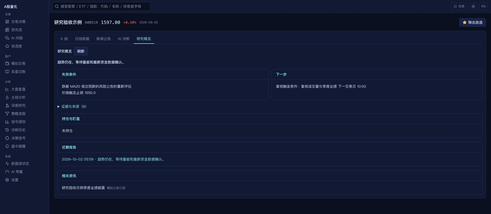

# daily_stock_analysis A 股对齐实施记录

> 本文保留该阶段的审计/实施快照。后续代码补齐及最新验证请看[全面补齐实施与最终验收](dsa_alignment_implementation_2026-10-02.md)，下文的待修复状态和测试数字不代表最终版本。

后续验收：[UI 与数据源](ui_data_source_alignment.md)、[数据源稳定性与策略正确性](data_strategy_reliability.md)。策略回测与权重的最终口径以后者为准。当前剩余差异及部署补修见[2026-10-02 全面复核](dsa_alignment_review_2026-10-02.md)。

本次以 [ZhuLinsen/daily_stock_analysis 的 be148f39](https://github.com/ZhuLinsen/daily_stock_analysis/commit/be148f39ce3be8bc7f9c2d5b0ad77cd31655e78f) 为参考，落实用户确认的「聚焦现有 A 股功能」范围。沿用本地 FastAPI、React、YAML 配置和短线交易流程，并在原有未提交的个股 profile 实现上补齐接口与页面。原始差距见[审计](dsa_alignment_audit_2026-10-01.md)，该报告记录的是修改前状态。

## 已落地的行为

| 审计编号 | 改动与验收边界 | 主要代码 |
| --- | --- | --- |
| 01 | A 股、国内 ETF/指数统一身份解析，支持大小写、全角、前后缀；交易所冲突返回 400；指数保留前缀，不能混入同形个股查询。 | `src/utils/stock_code.py`、`api/v1/stocks.py` |
| 02 | 未知方向、非法信心、布尔评分及 NaN/无穷/越界评分不参与观点投票；少于两个合法观点为 insufficient；共识方向由方向票决定。最终决策员评分无效时按低信心观望处理。 | `opinion_validity.py`、`skill_consult.py`、`diagnosis_agents.py`、`stock_diagnosis.py` |
| 03 | 公开任务、工具、运行日志、旧诊断读取和研究产物统一递归脱敏，先脱敏再截断。模型未知异常也使用脱敏后的文本。 | `src/utils/redaction.py`、`run_log.py`、`api/tasks.py` |
| 04 | 手动个股/基金诊断与问股共用总 deadline；并发观点预留决策预算。正常配置默认采用 spawn 独立进程，超时、取消、流关闭时终止进程树；流式问股保留部分回答。 | `execution_budget.py`、`analysis_process.py`、`stock_chat.py` |
| 05 | 登录及认证设置密码核验共享失败节流，超过五次失败返回 429 与 Retry-After，成功清除失败记录；修改已有认证配置先核验当前密码。 | `api/auth.py`、`api/v1/system.py` |
| 06 | 单标的诊断、问股及单源拉取由接口明确选择业务失败契约，返回 error 的任务记为失败；部分成功的批量任务仍保留原有语义。 | `api/tasks.py`、`api/v1/` |
| 07–09 | 增加版本化 ContextPack 和 ResearchArtifact；字段携带来源、时间、缺失/失败/估算/陈旧状态。profile 增加 history、intelligence、history_days 和 structured_report，Web 个股页新增研究概览。旧报告可生成兼容产物，但不会补造旧证据。 | `src/schemas/research.py`、`research_artifact.py`、`stock_profile.py`、`StockPage.tsx` |
| 10 | 单一 strategy_synthesis 保留有效观点、支持与反对阵营、冲突和少数意见；采用一次确定性审议，未解决冲突将信心上限压为低。 | `strategy_synthesis.py`、`stock_diagnosis.py` |
| 11–12、19 | 诊断、技能观点和决策信号共用 1/3/5/10 交易日后验；独立结果按 owner/horizon/engine_version 保存，中性带可配置。已完成结果不覆盖，缺基准价/缺交易日/尚未成熟明确区分。技能样本幂等，按标的、日期去重；30 个独立已评估样本后才应用 Beta(2,2) 有界权重。新版样本隔离策略与评估版本。 | `outcome_engine.py`、`skill_consult.py`、`diagnosis_outcome.py`、`decision_signals.py` |
| 13 | 新增季度财务与已实施现金分红适配，覆盖营收、净利、现金流、ROE、成长指标及 TTM 每股现金分红；明确人民币/元/百分比、累计报告期、日期与数据状态。日级缓存，拉取失败保留旧快照并标陈旧。诊断可用，选股只读取缓存。 | `quarterly_fundamentals.py`、`ResearchCache` |
| 14 | Chat 请求与历史保存显式 stock_context 和最多四个补充 skills；个股工具核验限定标的，名称查询也不能越界；代码别名规范化后复用成功工具结果。字符预算保留本轮问题和范围，旧对话摘要有界。 | `api/v1/chat.py`、`chat_sessions.py`、`stock_chat.py`、`ChatPage.tsx` |
| 15 | 后台任务持久化、revision/trace_id、终态与错误恢复；重启把未完成任务明确标成中断，损坏记录不阻止启动。通用任务 SSE 快照与 heartbeat，Web 优先 SSE、失败回退轮询。诊断关联 provider/model/attempt 耗时，问股保存轮次与工具耗时。 | `TaskRun`、`api/tasks.py`、`useTask.ts`、`run_log.py` |
| 16 | 六种原有短线策略继续可用，新增声明式 YAML 策略与价值质量、质量成长、股息价值、动量趋势、防守低波动示例。规则字段白名单，不执行表达式；历史回测拒用事后财务缓存。记录运行状态和覆盖量，覆盖不足保留上次成功结果，候选附本地公告/新闻风险。YAML 策略接入绩效与历史回测。 | `screening_rules.py`、`screener.py`、`strategy_backtest.py`、`ScreeningRun` |
| 17 | 提醒规则存入快照；冷却采用数据库条件更新，跨服务重建仍有效；事件记录规则归因与逐渠道尝试结果。免打扰与严重告警沿用原有语义。 | `alert_service.py`、`AlertRule/AlertCooldown/AlertRecord` |
| 18 | 持久化资讯源与去重条目，支持全市场/股票/行业范围、启停和单源拉取、失败原因；YAML 管理源与独立源分开标记，复用现有 RSS/Atom/NewsNow。指定其他股票的源不会被标题关键词混查进当前股票。 | `intelligence.py`、`rss.py`、`api/v1/intelligence.py`、`IntelligencePage.tsx` |
| 20 | 从脱敏 example 提供设置 schema；Web 可编辑调度时间与采集间隔，保存后更新现有触发器，保留暂停状态、未变更触发器和无关任务。新增设置均有 example 默认值和范围检查。 | `scheduler.py`、`api/v1/system.py`、`SettingsPage.tsx` |
| 21 | 诊断历史批量选择删除/按代码清理；自选股选中子集分析；诊断与自选报告分享图先准备文件、再次点击在用户激活期间触发 Web Share，支持下载回退。 | `HistoryPage.tsx`、`WatchlistPage.tsx`、`ShareImageButton.tsx` |
| 22 | 增加离线轨迹案例、覆盖/重复/失败/范围/运行时间指标，补齐文档与 README 已实现能力。 | `evals/agent_trajectory/`、`scripts/eval_trajectories.py`、`docs/` |
| 23 | CI 按路径分流，后端按文件稳定分成三片；macOS 使用 Intel x64 与 ARM64 两套 runner，增加 ZIP 更新包、afterPack 嵌套 Mach-O 签名审计，以及双架构更新元数据合并。 | `.github/workflows/`、`apps/desktop/scripts/`、`scripts/merge_release_assets.py` |

上表说明本次落地的本地行为，不代表上游所有字段、数据源和高级流程逐字相同。

用户追加的 UI 与数据源对齐已落地：首页研究工作台、报告结论/评分/价格计划、可编辑行情优先级、TickFlow、Tushare HTTP 网关和实时接口、逐源日线/财报健康记录、覆盖与日期价格校验、新数据来源/复权追溯。后续验收及截图见 [UI 与数据源对齐](ui_data_source_alignment.md)。下方验证表保留第一阶段的记录。

## 使用与兼容

启动时 `init_db()` 创建新增表并补 nullable 列，无改列名/删列/改已有类型。旧诊断及旧会话仍可读取。原始诊断 JSON 保留，读取时构建兼容研究产物；新产物携带真实报告 ID。数据库记录的字段契约见[研究与任务接口契约](research_contracts.md)。

常规配置通过 `settings.yaml.example` 合并默认值：`diagnosis.timeout_seconds=180`、`isolate_process=true`、`fundamentals=true`、`chat_context_chars=12000`；`evaluation.neutral_band_pct=0.5`。测试注入自定义模型/工具或省略隔离标志的最小配置仍可在进程内运行；该模式不能强制终止阻塞的第三方函数。

选股默认 `minimum_universe=3000`，样本不足时结果为 partial，数据库保留上次成功批次。`screening.rules_file=config/screening_rules.yaml` 不存在时读取 `.example`。修改自定义规则可直接复制示例；财务指标缺失不会被当成零来满足条件。

## 仍保留的差异

- ContextPack 为现有诊断快照提供统一结构；还未将所有市场结构、告警与深度研究内部数据完全迁移到单一上游 schema。历史文本资讯的发布日期不可恢复时标 unknown。
- 多策略使用确定性单轮审议，未增加额外 LLM 复辩调用。研究产物展示与告警仍分别读取本地稳定接口。
- 选股补齐 YAML、覆盖保护、财务缓存和候选风险，尚未移植上游完整 AlphaSift 热点详情、联网候选资金流及 LLM 后置重排。季度财务为累计报告口径，不声称已计算完整单季差分。
- 新后验层共用引擎，原有信号生命周期、交易回测与旧显示字段保留；中性样本可在新后验层评估，技能调权仍只使用有效方向样本。旧无版本记录保持兼容口径。
- 运行诊断已有关联事件与耗时，尚无上游完整 run-flow 图和逐 API Key 独立轨迹；通用任务恢复终态，重启不会自动重跑中断工作。提醒规则编辑仍以现有 YAML 配置为准。
- 问股按字符限制上下文，并使用确定性历史摘要；不宣称已实现模型专属 token 计数或模型生成的滚动摘要。轨迹评估是执行契约门禁，不是投资准确率或真实 LLM 质量结论。
- macOS 签名清理不提供 Developer ID 或公证。双架构发行流程已修改，实际安装包签名、安装与自动更新需在发行环境验收。
- 用户确认排除的海外市场、多币种持仓、本地 CLI 模型、海外舆情和新增通知 Bot/语言未纳入本次。

## 验证记录

验证全部使用临时数据库、虚构凭据、离线替身；浏览器连接只监听本机的隔离服务，页面内股票名称为「研究验收示例」。没有执行真实模型调用、外部通知或交易。

| 命令/流程 | 结果 |
| --- | --- |
| `.venv/bin/python -m pytest -q -p no:cacheprovider tests/` | 1804 passed；随后新增三项回归，最终以 CI 三片运行覆盖全部 1807 项，见下一行。 |
| `.venv/bin/python scripts/pytest_shard.py --index {0,1,2} --count 3`（逐片执行） | 512 + 462 + 833 = 1807 passed，三片无文件重复或遗漏；仅第三方依赖弃用警告。 |
| `.venv/bin/python tests/test_basic.py`、`.venv/bin/python tests/test_self_learning.py` | 两套脚本式回归通过。 |
| `cd apps/web && npm run lint && npm test && npm run build` | lint、TypeScript 与 Vite 构建通过；39 个测试文件、169 项测试通过。 |
| `cd apps/desktop && npm test` | 24 项通过；测试替换 Electron，仅本机 socket。 |
| `bash -n scripts/macos_signature_audit.sh`、`node --check apps/desktop/scripts/afterPackMacos.js` | 脚本语法通过；CI/release 与两个配置 YAML 均解析通过。 |
| 浏览器模拟数据验收 | 研究概览、证据展开、资讯源、历史选择、问股范围与调度编辑入口，见截图。 |

新增回归重点覆盖进程超时/取消/子进程树清理、身份冲突、无效观点与决策评分、脱敏、持久化任务与 SSE、暂停任务热更新、独立样本/版本/中性带、来源范围、季度财报单位与缓存降级、YAML 条件及覆盖不足保留结果、Web Share 用户激活与轮询回退。

研究页截图（隔离模拟数据）：

其余界面验收截图：[资讯源管理](screenshots/dsa-intelligence-sources.png)、[历史批量选择](screenshots/dsa-history-selection.png)、[问股限定标的](screenshots/dsa-chat-scope.png)、[调度编辑](screenshots/dsa-scheduler-editor.png)。浏览器未记录控制台 error。
