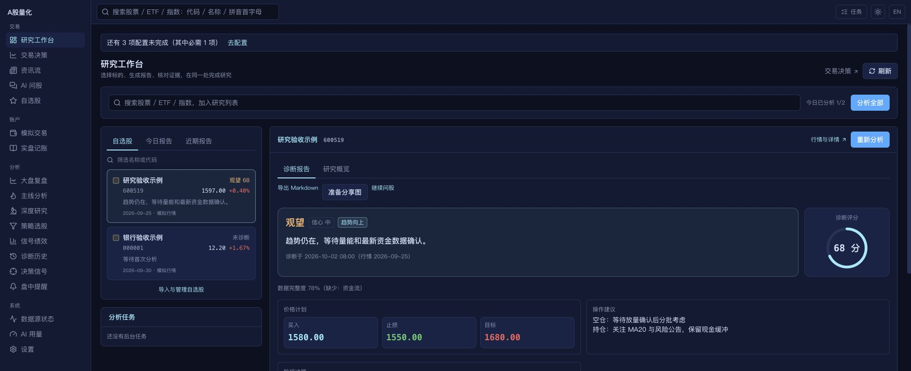
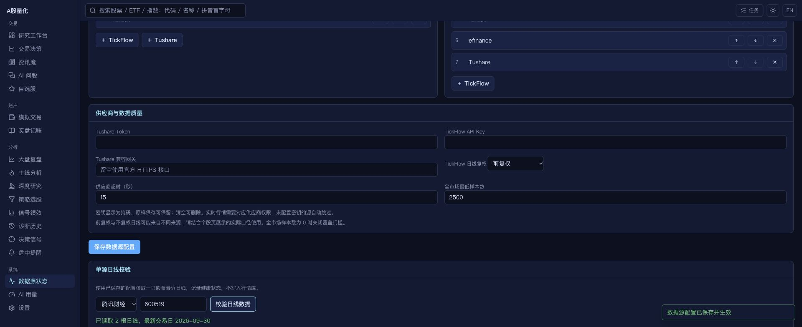

# UI 与数据源对齐实施及验收

参考 [daily_stock_analysis 固定提交 be148f39](https://github.com/ZhuLinsen/daily_stock_analysis/tree/be148f39ce3be8bc7f9c2d5b0ad77cd31655e78f)，延续用户确认的现有 A 股范围。界面参考上游 HomePage、HomeStockWorkspace 与报告样例；行情参考 TickFlowFetcher、TushareFetcher 及供应商正式接口。本记录补充[第一阶段实施](dsa_alignment_implementation.md)，不表示与上游所有功能完全相同。

## 界面行为

- `/` 为研究工作台：左侧自选/今日/近期报告，右侧当前报告/研究概览，任务和错误进度同时可见。支持搜索添加、名称/代码筛选、选中子集分析；工作台批量分析不发送通知。
- 历史报告按记录 ID 加载，Markdown/分享图导出使用同一 ID；切换股票时，延迟返回的旧报告不能覆盖新选择。重新分析更新当前报告，刷新与批量完成后重新取最新报告。
- 报告突出行动、信心、核心结论与评分，买入/止损/目标分别展示；保留阶段决策、护栏、分析过程、研究证据及持仓建议。
- “继续问股”携带 `?code=`，新会话直接保留限定标的。服务器已保存的任务会恢复到界面；低 revision 的列表快照不能覆盖较新的流式进度。
- 原交易决策页移至 `/market`；其他页面入口继续可用。390px 手机布局按列堆叠，菜单支持导航。
- `/sources` 新增“来源与优先级”：调整实时行情与日线顺序、启停来源、保存凭据和质量门槛；另有运行状态、能力总览以及单源日线检查。

## 数据源及实际口径

| 数据 | 来源与行为 | 单位/复权 |
| --- | --- | --- |
| 默认实时行情 | 腾讯、东方财富、新浪、efinance、通达信；可调整顺序与覆盖门槛。 | 数据库成交量为股、成交额为元；实时价格不复权。 |
| 可选实时行情 | TickFlow `CN_Equity_A` 与 Tushare `rt_k`；缺密钥自动跳过，有密钥但权限失败会记录错误并回退。 | TickFlow A 股成交量手→股、涨跌/换手比例→百分比；Tushare `rt_k.vol` 已是股。 |
| 默认日线 | 腾讯、新浪、东方财富、baostock、通达信、efinance、Tushare；逐源记录成功、失败与熔断。 | 通达信/Tushare 日线不复权，其他默认前复权；Tushare daily 成交量手→股、成交额千元→元。 |
| TickFlow 日线 | 上海时区的起止日期/时间戳，SDK `klines.get`，检查返回上限和区间。 | 成交量手→股；可选不复权、前/后复权及加法复权，记录实际配置。 |
| 季度财报 | 新浪财报摘要失败后继续尝试财务指标；成功记录具体 provider。 | 人民币/元/百分比、报告期累计口径。 |
| 现金分红 | 已实施事件，保留除权除息日；单独记录健康状态。 | 税前每股现金与过去一年合计。 |

供应商契约核对：[TickFlow 官方 SDK](https://github.com/tickflow-org/tickflow/blob/main/README.md)、[TickFlow 官网](https://tickflow.org/)、[Tushare 实时日 K 官方文档](https://tushare.pro/document/2?doc_id=372)。Tushare 新增 HTTP 兼容网关，留空走官方 HTTPS；请求使用 JSON、显式超时。TickFlow 禁用 SDK 内部自动重试，外层采集链管理回退。

实时源存在行情日期时，逐条核对入库交易日；去掉无效身份、非正/非有限收盘价与重复代码后计算有效覆盖量。历史源严格解析日期，保留区间内合理正数 OHLC；同日重复先取最后一条，再验证，避免无效价格借有效日期混入。失败缓存按标的和日期区间隔离，数量有上限；需要陈旧回退的调用可设置最大年龄，实时行情不使用陈旧缓存。

新 `stock_daily` 行新增可空的 `source` 与 `price_adjustment`，启动自动补列。个股页、历史接口、profile、自选股与新诊断快照保留实际来源、口径或更新时间；旧行来源仍为未知，不补造供应商。批量历史回补与按需补齐使用同一转换逻辑。

## 配置与接口

默认值见 `config/settings.yaml.example` 的 `data_sources`：实时/日线列表、`tushare_token`、`tushare_http_url`、`tickflow_api_key`、`tickflow_kline_adjust`、`request_timeout_seconds=15`、`minimum_realtime_rows=2500`、`pytdx_servers`。超时仅用于新增供应商 HTTP/SDK 请求；最低覆盖量设为 0 可关闭门槛。

| 接口 | 用途 |
| --- | --- |
| `GET /api/v1/watchlist/workspace` | 本地自选、今日及最近 30 天报告，最多读取 100 条，近期列表展示前 30 条。 |
| `GET/PUT /api/v1/settings/data-sources` | 读取脱敏配置、校验并保存，更新应用及常驻采集器；后续采集使用新顺序。 |
| `POST /api/v1/system/sources/probe` | 按已保存配置提交单股票/单源最近日线检查，更新健康记录，不写行情库。 |

密钥返回 `******`，原样保存保留现有值，清空删除文件配置；环境变量仍按原有优先级生效。公开错误先替换供应商回显密钥，再统一脱敏。新增依赖 `tickflow>=0.1.24`；桌面打包包含其导入。

## 验收证据

| 验证 | 结果 |
| --- | --- |
| `.venv/bin/python -m pytest -q -p no:cacheprovider tests/` | 1845 passed；4 项第三方弃用警告。所有供应商回归均使用离线替身和临时数据库。 |
| `cd apps/web && npm run lint && npm test && npm run build` | lint、TypeScript、生产构建通过；40 文件、176 项测试通过。 |
| `.venv/bin/python scripts/check_sources.py --only 腾讯行情,历史日线 --no-browser` | 实际免费接口读取 2/2 成功：腾讯 3 只、历史日线 20 根；不写数据库。 |
| 隔离浏览器验收 | 历史报告/导出身份、问股代码、优先级保存与模拟单源检查、任务回显均通过；390px 视口无横向溢出；控制台 error 为 0。 |

后端回归覆盖网关 JSON/超时、实时与历史单位差异、上海日期、异常价格、重复日线、无效身份、92 开头北交所代码、逐源回退/健康、缓存隔离与年龄、密钥保留/清空/回显脱敏、配置即时生效、来源契约和单源检查不写库。前端覆盖空状态、子集分析不推送、历史 ID、切换竞态、任务恢复/版本及设置保存。

浏览器使用隔离临时数据库，“研究验收示例/银行验收示例”与供应商检查返回均为模拟数据；未调用真实模型、通知或交易。界面截图：

手机截图：[工作台](screenshots/dsa-workspace-mobile.png)、[报告](screenshots/dsa-report-mobile.png)。

## 明确保留的边界

- TickFlow/Tushare 已按 SDK/正式接口实现并用离线契约验证；没有实际供应商密钥，本次未验证其真实账户权限、额度和网关可用性。免费接口连通成功不代表所有来源在所有部署网络可用。
- 健康记录与熔断仍按进程保存，界面只展示本进程的运行；独立诊断进程的健康不会自动合并，服务重启后未探测来源显示未知。
- 逐行标记复权方式，不重写旧行情，也不将混合来源历史重新复权成一套序列。旧未知来源和混合口径要结合实际数据查看。
- 实时源未提供可用日期字段时无法单独核验时间，仍依赖交易时段采集门禁；支持日期的源执行严格校验。
- 保留本地导航与交易工作流，没有移植上游完整动画、run-flow 图及每个高级页面；海外市场/多币种/CLI 模型按用户选定范围继续排除。
